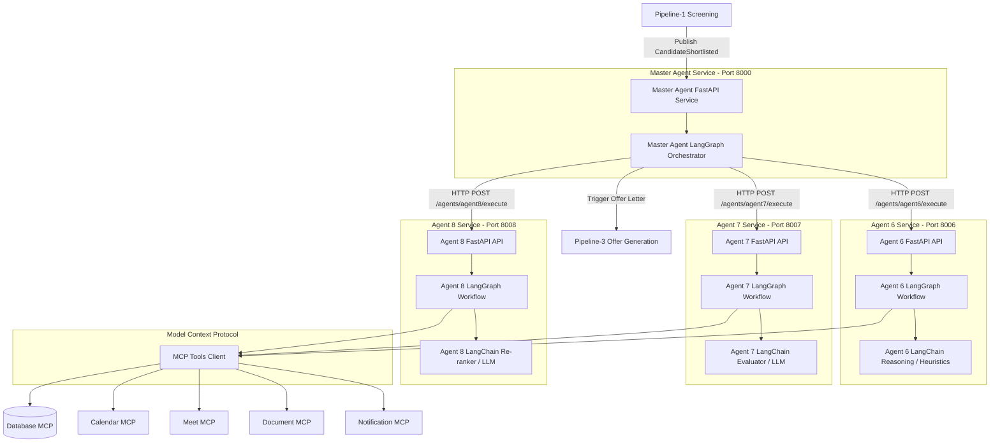
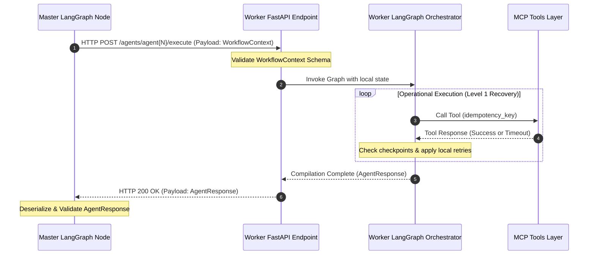
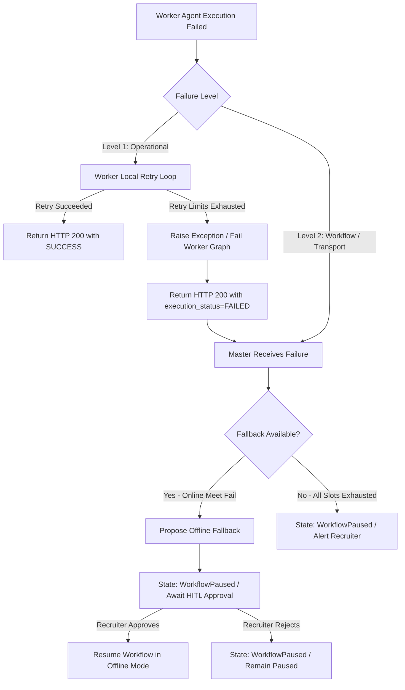
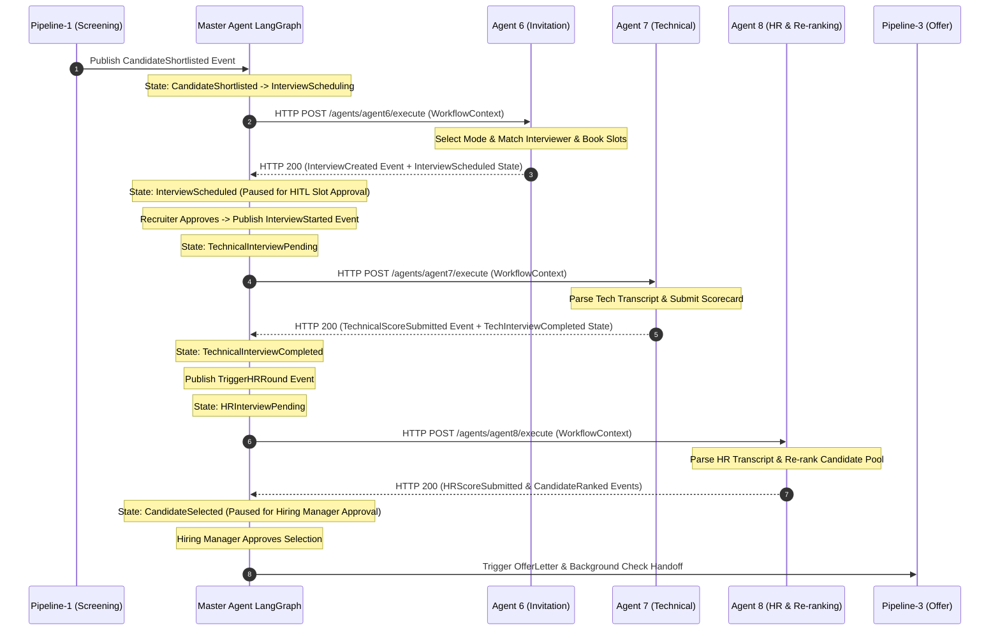

# OxiqAI HRMS - Recruitment Pipeline-2
## HIGH-LEVEL DESIGN (HLD): INTERVIEW MANAGEMENT ARCHITECTURE (LANGGRAPH + FASTAPI)

---

## 1. Introduction

### Purpose
The purpose of **Pipeline-2 (Interview Management)** is to govern, coordinate, and evaluate the candidate interview lifecycle. It automates interview scheduling, evaluation review, and re-ranking while maintaining absolute data integrity, auditability, and human oversight.

### Process Boundaries
- **Entry Trigger:** Pipeline-2 begins when a candidate is shortlisted by **Pipeline-1 (Screening)**. The screening system emits a `CandidateShortlisted` event containing profile metadata, resumes, and initial evaluation scores.
- **Exit Trigger:** Pipeline-2 concludes when a candidate successfully completes all evaluation loops (or is rejected/withdrawn) and the orchestrator triggers **Pipeline-3 (Offer Management)** for final negotiations and onboarding steps.

### Architectural Paradigm
Pipeline-2 utilizes a **distributed Agentic Master-Worker approach** orchestrated by **LangGraph + LangChain** and connected via **FastAPI HTTP endpoints**. A central Master Agent LangGraph manages workflow state and orchestration, delegating all domain-specific tasks to specialized, stateless worker agent LangGraphs over secure HTTP boundaries. All integrations use the Model Context Protocol (MCP).

---

## 2. System Architecture

The target runtime communication topology separates boundaries of execution using FastAPI services, LangGraph orchestration, LangChain reasoning, and MCP tool boundaries.

```
"FastAPI connects the agents.
 LangGraph orchestrates them.
 LangChain powers reasoning where required.
 MCP connects tools.
 Explicit policies control recovery."
```

### System Architecture Diagram (Mermaid)



### Centralization, Isolation, and Boundaries
*   **Decoupled HTTP Service Boundaries:** The Master Agent and each worker agent run as separate FastAPI microservices. The Master Agent has **zero runtime import dependency** on worker implementation classes.
*   **The Master Agent is the sole orchestrator:** It holds the global state machine, evaluates state transitions, handles human feedback triggers, and coordinates handoffs.
*   **No Worker Peer-to-Peer Communication:** Sub-agents never invoke or communicate with other sub-agents. Agent 6 has no awareness of Agent 7 or Agent 8.
*   **Centralized Handoff:** All inputs, execution logs, and outputs must return to the Master Agent for verification and validation before moving to the next pipeline state.

---

## 3. Master-Worker Request Flow

All communication between the Master LangGraph and worker LangGraphs occurs via HTTP POST requests transmitting Pydantic JSON contracts.

### Request Flow Diagram (Mermaid)



---

## 4. State Ownership Principle

To prevent competing state conflicts, Pipeline-2 strictly segregates runtime orchestration state from cross-service domain state.

### A. WorkflowContext (Domain & Cross-Service State)
The `WorkflowContext` is the **authoritative cross-service domain contract** passed between FastAPI endpoints. It encapsulates candidate profiles, execution history, active state flags, and step parameters. It does NOT change during graph execution; it is updated only at graph completion boundaries.

### B. LangGraph Graph State (Runtime Orchestration State)
The `LangGraph Graph State` is the **local runtime execution state** maintained internally by LangGraph nodes during a workflow execution cycle. The Graph State references/carries the `WorkflowContext` as an inner attribute, and additionally tracks graph-local metadata:
- `current_node`: Active executing node key.
- `retry_count`: Local operational retry counter.
- `last_error`: Text/traceback of the last encountered error.
- `pending_approval`: Flag representing a pending HITL prompt.
- `service_invocation_result`: Storage for active API responses.
- `fallback_applied`: Active fallback configuration.

---

## 5. Failure & Recovery Ownership Model

Pipeline-2 defines two distinct layers of error handling to separate transient network hiccups from core business state pivots.

```
"The worker handles operational recovery.
 The Master handles workflow-level recovery."
```

### A. Level 1: Worker Operational Recovery
Worker LangGraphs own operational recovery when a failure can be resolved locally without altering the candidate's recruitment lifecycle status or requiring human intervention.
- **Examples:** Google Calendar API timeouts, Database MCP transaction timeouts, document compilation issues, Notification SMTP delivery failures.
- **Handling:** The worker LangGraph uses local loop retries and idempotency keys to resume execution from the failed node. If recovered, it returns HTTP 200 with `execution_status="SUCCESS"`.

### B. Level 2: Master Workflow Recovery
The Master Agent LangGraph owns workflow recovery when the failure cannot be resolved locally and requires pivoting the business logic, changing the interview mode, or escalating to human operators.
- **Examples:** Online meeting creation service permanently unavailable, all available scheduling slots/interviewers exhausted, worker FastAPI service unreachable after retries (HTTP 503/504), human rejects proposed schedule.
- **Handling:** The Master Agent catches the failed business status (`execution_status="FAILED"`) or transport exception, evaluates fallback paths (e.g. pivoting Online to Offline mode), pauses the workflow state to `WorkflowPaused`, and queues a HITL action.

### Failure / Fallback Flow Diagram (Mermaid)



---

## 6. Pipeline-2 End-to-End Orchestration Sequence

The complete chronological flow of a candidate loop across all three worker agents:



---

## 7. Model Context Protocol (MCP) Layer

The **Model Context Protocol (MCP)** defines the interface standard for resource access and tool invocation. Sub-agents do not query the database or access external endpoints directly; they use registered tool wrappers that translate calls into JSON-RPC over the MCP layer.

### Internal MCP Servers
*   **Database MCP:** Scoped read/write queries on candidate, schedule, evaluation, and ranking tables. Enforces database boundaries.
*   **Resume MCP:** Secure parser to retrieve, search, and extract elements from resumes.
*   **Notification MCP:** Dispatches system alerts and recruiter notifications via email or Slack.
*   **Document MCP:** Generates PDF scorecard templates and interview packages.
*   **Analytics MCP:** Standard telemetry tracking for latency and costs.
*   **Company Policy MCP:** Exposes current guidelines and hiring regulations.
*   **Salary Band MCP:** Retrieves approved compensation ranges.

### External MCP Servers
*   **Google Calendar MCP:** Workspace API synchronization for schedules and bookings.
*   **Google Meet MCP:** Generates virtual conferencing links.
*   **SMTP Mail Service:** Dispatches schedules, updates, and templates.

---

## 8. Human-in-the-Loop (HITL)

LangGraph's native thread interrupt capabilities are leveraged to pause stateful workflows at predefined checkpoints, pending recruiter or hiring manager action:

1.  **Slot Booking Approval:** Master Agent pauses the workflow after Agent 6 registers the calendar booking, waiting for the recruiter to confirm the slot choice.
2.  **Technical Score Verification:** Agent 7 drafts the technical scorecard from the transcripts, pausing for the interviewer to review and verify before finalizing.
3.  **Hiring Selection Approval:** Master Agent pauses after Agent 8 re-ranks the active candidate cohort, waiting for the hiring manager's final selection override before triggering Pipeline-3.

---

## 9. Baseline Stability

The Phase 4 python in-process implementation serves as our **Verified Behavioral Reference Baseline**.
*   **Test baseline requirement:** 37 passed, 0 failed.
*   The migration must be performed incrementally, ensuring the existing functional and contract tests continue to pass at all stages.
