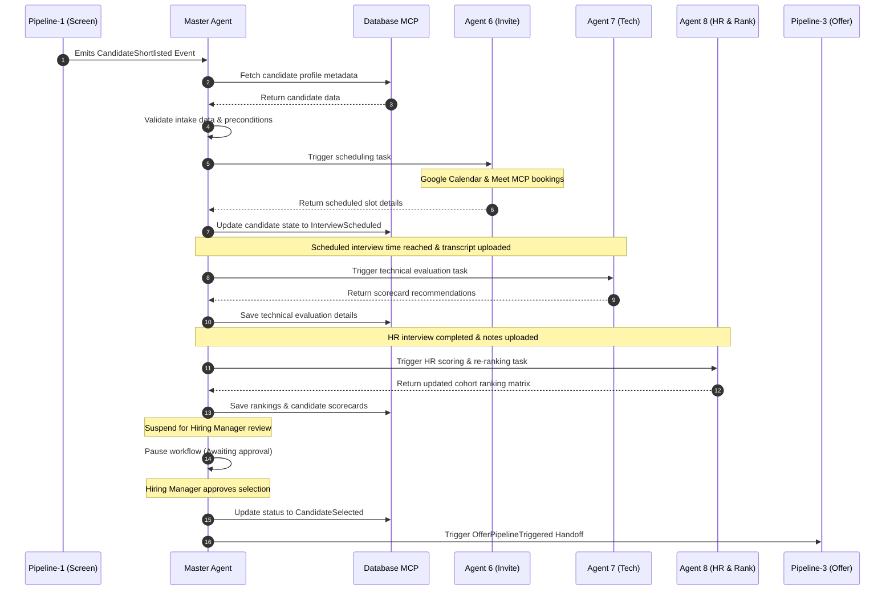
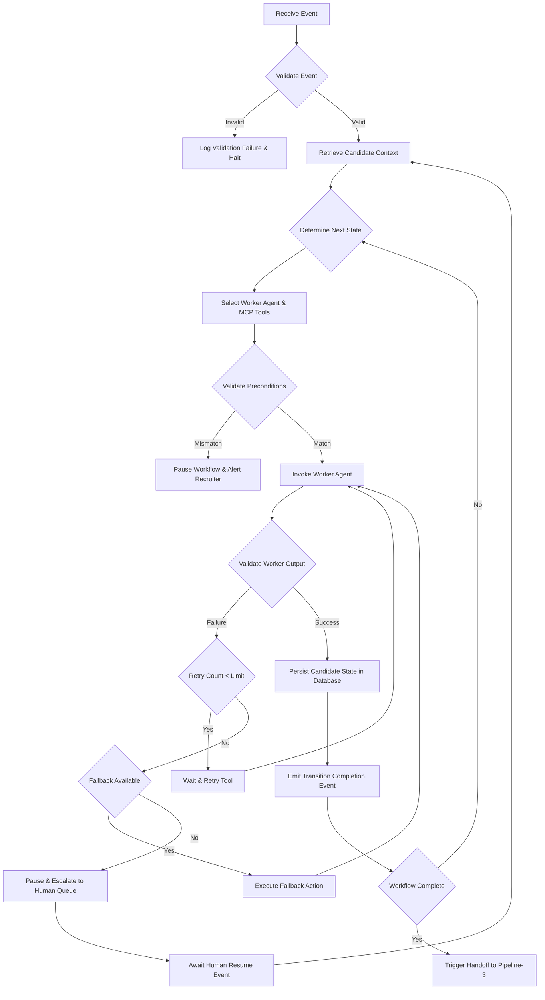

# OxiqAI HRMS - Recruitment Pipeline-2
## MASTER ORCHESTRATION AGENT SPECIFICATION

---

## 1. Purpose

The **Master Orchestration Agent** is the central execution engine (the "brain") of Pipeline-2 (Interview Management). Its roles are strictly limited to orchestration:
- **No Business Logic:** The Master Agent does not write evaluations, schedule dates directly, or calculate candidate rankings.
- **Workflow Coordination:** Manages execution flow, updates candidate states, and dispatches parameters to worker agents.
- **State Management:** Coordinates database commits to record pipeline milestones.
- **MCP Coordination:** Acts as the central caller for database, notification, and utility MCP tools.
- **Failure Recovery:** Standardizes transient retry loops, fallback routines, and human escalation queues.
- **Pipeline Handoff:** Integrates candidate intakes from Pipeline-1 and selection closures to Pipeline-3.

---

## 2. Master Agent Overview

The Master Agent controls the candidate pipeline lifecycle by managing:
- **Lifecycle Engine:** Monitors state transitions from intake to close.
- **Context Manager:** Gathers profiles, criteria, and scores, preparing input payloads for worker agents.
- **Event Router:** Receives incoming transaction events and routes them to target agents.
- **Validation Checkpoint:** Verifies database records and inputs/outputs before state changes.
- **Retry and Fallback Engine:** Handles API timeouts and tool failures.
- **Observability:** Logs all trace paths, execution latencies, and tool calls.
- **HITL Manager:** Manages workflow pauses and resumes during manual human reviews.

---

## 3. Master Agent Responsibilities

The Master Agent must perform the following tasks during execution:
- **Process Events:** Validates and routes system events (e.g., `CandidateShortlisted`).
- **Context Retrieval:** Queries the Database MCP to load profile metadata.
- **Context Validation:** Ensures candidate records are consistent before starting execution.
- **State Engine Routing:** Maps current state to next state transition paths.
- **Select Sub-Agent:** Identifies the appropriate worker (A6, A7, A8) for the active task.
- **Context Preparation:** Packages Pydantic parameters containing only the context required for the worker's task.
- **Precondition Verification:** Validates prerequisite tasks (e.g., confirming a scheduling record exists before triggering Agent 7).
- **Invoke Agent:** Sends payload details and triggers worker tasks.
- **Verify Worker Output:** Checks returned worker outputs against target schemas.
- **Persist State:** Triggers database tools to update candidate status flags.
- **Emit Handoff Event:** Emits progress events to trigger the next execution loop or Pipeline-3.
- **Suspend/Resume Workflow:** Pauses execution to await human actions, and resumes upon approval.

---

## 4. Workflow Ownership

The Master Agent is the sole owner of:
- **Global States:** Candidate progress status flags in the database.
- **Workflow Context:** Unified candidate files and history records.
- **Workflow Memory:** Session keys and execution history.
- **Telemetry Logs:** Tracing outputs across agents.

> [!IMPORTANT]
> **Isolation Rule:** Worker agents (Agent 6, 7, 8) are stateless and must not maintain, mutate, or assume responsibility for the candidate's global pipeline state.

---

## 5. Context Management

The Master Agent includes a **Context Manager** module responsible for:
- **Context Retrieval:** Queries the Database MCP to fetch candidate records, CV paths, and job criteria.
- **Context Aggregation:** Combines multiple source records (e.g., screening scores + technical assessments) into a unified dataset.
- **Context Validation:** Verifies that all required fields are present and formatting matches specifications.
- **Context Preparation:** Extracts only the subset of data fields needed for the active worker agent's task.
- **Context Distribution:** Packages parameters as a validated Pydantic model and dispatches it to the worker.

---

## 6. Event Management

The state machine is driven by these events:

```
┌────────────────────────────────────────────────────────┐
│                      EVENT INTAKE                      │
│ - CandidateShortlisted (Screening pipeline handoff)    │
│ - InterviewScheduled / Rescheduled (A6 scheduling)     │
│ - TechnicalScoreSubmitted (A7 assessment)             │
│ - HRScoreSubmitted / CandidateRanked (A8 evaluation)    │
└──────────────────────────┬─────────────────────────────┘
                           ▼
┌────────────────────────────────────────────────────────┐
│                   MASTER AGENT ROUTER                  │
│  - Event Validation (Check payload schemas)            │
│  - State Mapping (Identify target phase)               │
│  - Output Event Dispatch                               │
└──────────────────────────┬─────────────────────────────┘
                           ▼
┌────────────────────────────────────────────────────────┐
│                     EVENT OUTPUTS                      │
│ - OfferRequested / PipelineTriggered (Handoff)         │
│ - WorkflowPaused / WorkflowResumed (HITL review)       │
│ - WorkflowFailed (Fatal execution failure)             │
└────────────────────────────────────────────────────────┘
```

---

## 7. Agent Orchestration Engine

The Agent Orchestration Engine manages worker executions:
1.  **State Check:** Evaluates the candidate's current state and identifies the target next phase.
2.  **Rule Check:** Verifies business criteria (e.g., checking if the candidate has passed screening before scheduling).
3.  **Identify Worker:** Selects the sub-agent configured for the target state (A6 for scheduling, A7 for tech evaluation, A8 for HR).
4.  **Prepare Parameters:** Packages task parameters into Pydantic models.
5.  **Trigger Execution:** Invokes the worker and awaits the output.
6.  **Verify Output:** Validates the returned payload against target schemas.
7.  **Progress State:** Updates candidate status and emits completion events.

> [!CAUTION]
> **Sequential Execution:** The Master Agent must execute worker tasks sequentially. Parallel agent executions are forbidden to ensure transaction consistency.

---

## 8. MCP Orchestration

The Master Agent coordinates MCP tool usage:
- **Tool Mapping:** Identifies the minimum set of MCP tools required for each task.
- **Credential Separation:** The Master Agent handles connections to MCP servers, keeping worker agents isolated from raw database clients or API keys.
- **Output Validation:** Validates MCP return values before passing them to worker agents.
- **Outage Protection:** Manages retry limits and fallbacks for MCP tool timeouts.

---

## 9. State Management

The Master Agent maintains workflow states independently of worker agent execution:
- **Current State:** Active candidate status flag stored in PostgreSQL (e.g., `TechnicalInterviewPending`).
- **Previous State:** Tracks the last verified status flag (e.g., `InterviewScheduled`).
- **Workflow History:** Log containing timestamps, transition events, and agent outputs.
- **Execution Metadata:** Telemetry data including token usage, latency, and call IDs.

---

## 10. Validation Engine

Before transitioning states, the Validation Engine verifies:
- **Candidate Record:** Candidate exists and is registered.
- **Active Job:** Associated job requisition is active.
- **Interview Details:** Scheduled time and event ID are confirmed.
- **Evaluation Scores:** Assessment scorecard inputs are present and complete.
- **Tool Status:** Required MCP servers are online and responsive.
- **Workflow Rules:** Preconditions are satisfied (e.g., verifying a tech scorecard exists before routing to HR).

---

## 11. Retry Engine

The Retry Engine handles transient execution errors:
- **Scope Limit:** Retries are restricted to transient failures (such as network timeouts or API rate limits).
- **No Logical Retries:** Business errors (such as invalid payloads or validation failures) must not trigger retries.
- **Backoff Rules:** Retries use exponential backoff (e.g., retrying after 2s, 4s, 8s).
- **Attempt Limit:** Limit execution to a maximum of 3 retries. If the tool still fails, trigger fallback logic.

---

## 12. Fallback Engine

If retries are exhausted, the Fallback Engine routes execution to alternative paths:

| Failed Event | Fallback Action | Target State | Escalation Trigger |
| :--- | :--- | :--- | :--- |
| **Calendar booking failure** | Retrieve alternative slot suggestions from Agent 6. | `InterviewScheduling` | Alert recruiter if all slots are unavailable. |
| **Meet link timeout** | Switch meeting type to offline phone call or standard line. | `InterviewScheduled` | Notify interviewer of communication method change. |
| **SMTP mail timeout** | Send notification alert using Notification MCP. | `InterviewScheduled` | Flag message delivery failure in recruiter dashboard. |
| **Database timeout** | Rollback current transaction and retry after delay. | Current active state | Queue database connection alert to IT operations. |
| **Low LLM confidence** | Suspend auto-routing and queue manual review. | `WorkflowPaused` | Place task in human-in-the-loop queue. |

---

## 13. Human Approval Manager

When human reviews are required, the Human Approval Manager coordinates the pause/resume flow:
1.  **State Pause:** Updates candidate status to `WorkflowPaused` and suspends execution.
2.  **Notification:** Sends review details to the recruiter or hiring manager.
3.  **Queue Entry:** Registers the review task in the human approval database table.
4.  **Listen for Action:** Awaits user input (approve, reject, or override).
5.  **State Resume:** Processes the user action, updates the database, and resumes the workflow.

---

## 14. Logging & Observability

Observability is a core responsibility of the Master Agent. It logs the following structured JSON events:
- **`Workflow Started / Completed`:** Lifecycle boundaries.
- **`Workflow State Changed`:** Details previous and target states.
- **`Agent Invoked / Completed`:** Worker execution times and statuses.
- **`MCP Call Executed`:** Tool name, parameters, latency, and status.
- **`System Failures / Retries`:** Failed tools, retry attempts, and fallback routes.
- **`Human Approvals`:** Approver details, wait times, and actions.
- **`Trace ID Propagation`:** Every log message must include the unique `trace_id` associated with the candidate.

---

## 15. Pipeline Integration

Pipelines communicate exclusively through database records and transition events:
- **Pipeline-1 Intake:** Pipeline-1 writes candidate profiles to the database and emits `CandidateShortlisted`. The Master Agent processes the event and starts Pipeline-2.
- **Pipeline-3 Handoff:** Once evaluations and rankings are finalized, the Master Agent writes selection details to the database and emits `OfferPipelineTriggered`, triggering the closing process.

---

## 16. Security & Governance

-   **Access Constraints:** Enforces database and MCP access rules based on the least privilege principle.
-   **Context Isolation:** Worker agents only receive the subset of candidate details needed for their assigned task.
-   **Sanitization:** Sanitizes tool inputs to prevent database injection vulnerabilities.
-   **Audit Integrity:** Every state update is logged with the trace ID and timestamp.

---

## 17. Future Scalability

The modular orchestration design supports future updates without redesigning the architecture:
-   **New Agent Modules:** Add the new agent folder (e.g., `agents/agent9/`) and map its trigger event in the Master Agent's state engine.
-   **Custom MCP Integrations:** Add new MCP servers, keeping existing agent configurations unchanged.
-   **Parallel Workflows:** Expand routing logic to support parallel executions (e.g., executing multiple interview rounds simultaneously) without modifying worker agents.

---

## 18. Sequence Diagram

Below is the Mermaid sequence diagram showing the orchestration flow:



---

## 19. Decision Flow

Below is the decision flowchart describing event routing and failure handling:



---

## 20. Summary

This `master_agent.md` document defines the operational architecture for the Master Orchestration Agent in Pipeline-2. All state transitions, agent triggers, and external integrations must comply with these guidelines. Enforcing these routing rules ensures system consistency, observability, and auditability throughout the recruitment lifecycle.
